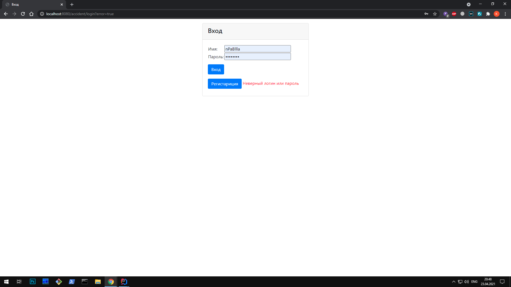

# job4j_car_accident
## Проект "Автонарушители"
### Веб-приложение для добавления и редактирования автонарушений
## Используемые технологии
* Spring (Core, MVC, Data, Security)
* Jsp, Html
* Hibernate
* PostgreSQL
* Log4j, Sl4J
* Maven
* Apache Tomcat
* Travis CI, CheckStyle

## Интрефейс приложения
### Страница авторизации

### Необходимо ввести данные корректные данные

### Страница регистрации

### Необходимо ввести корректные данные

### Главная страница после логина

### Добавим нарушение

### Необходимо ввести данные

### Введем данные

### Основная страница после добавления

### Отредактируем нарушение

### Введем новые данные

### Основная страница после редактирования

